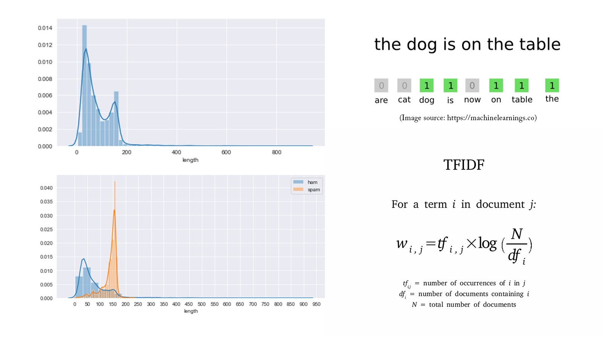

# Portfolio
---
### Impact of a New E-commerce Web Page on Conversion Rate: A/B Testing

 

In this project we will run an A/B testing analysis by leveraging the Chi-Square test for independence and assess the impact of a new ecommerce web page on the users conversion rate compared to an existing web page. We cleaned the data and defined the required hypothesis for the test. our analysis showed that it will not be a good idea for the company to change their old web page for the new one at the moment.

[more...](projects/AB Testing New Web Page.html)

---
### Customers Cohort Retention Analysis

 

In this project, we conduct a time-based cohort and retention analysis in python to examine how many customers are staying and how many are leaving in a given cohort over time. We will group customers into cohorts based on the time of acquisition and compute the cohort index which is the number of months since the customer was acquired. We will then compute the retention rates for each cohort over time.

[more...](projects/Cohort Retention Analysis.html)

---
### Detect Spam Messages: TF-IDF and Naive Bayes Classifier

In order to predict whether a message is spam, first I vectorized text messages into a format that machine learning algorithms can understand using Bag-of-Word and TF-IDF. Then I trained a machine learning model to learn to discriminate between normal and spam messages. Finally, with the trained model, I classified unlabel messages into normal or spam.

 

 

---
## Data Science

### Credit Risk Prediction Web App

After my team preprocessed a dataset of 10K credit applications and built machine learning models to predict credit default risk, I built an interactive user interface with Streamlit and hosted the web app on Heroku server.

 

 

---
### Kaggle Competition: Predict Ames House Price using Lasso, Ridge, XGBoost and LightGBM

I performed comprehensive EDA to understand important variables, handled missing values, outliers, performed feature engineering, and ensembled machine learning models to predict house prices. My best model had Mean Absolute Error (MAE) of 12293.919, ranking <b>95/15502</b>, approximately <b>top 0.6%</b> in the Kaggle leaderboard.

 

 

---
### Predict Breast Cancer with RF, PCA and SVM using Python

In this project I am going to perform comprehensive EDA on the breast cancer dataset, then transform the data using Principal Components Analysis (PCA) and use Support Vector Machine (SVM) model to predict whether a patient has breast cancer.

 

 

---
### Business Analytics Conference 2018: How is NYC's Government Using Money?

In three-month research and a two-day hackathon, I led a team of four students to discover insights from 6 million records of NYC and Boston government spending data sets and won runner-up prize for the best research poster out of 18 participating colleges.

 

 

---

© 2020 Jacob Appia. Powered by Jekyll and the Minimal Theme.

