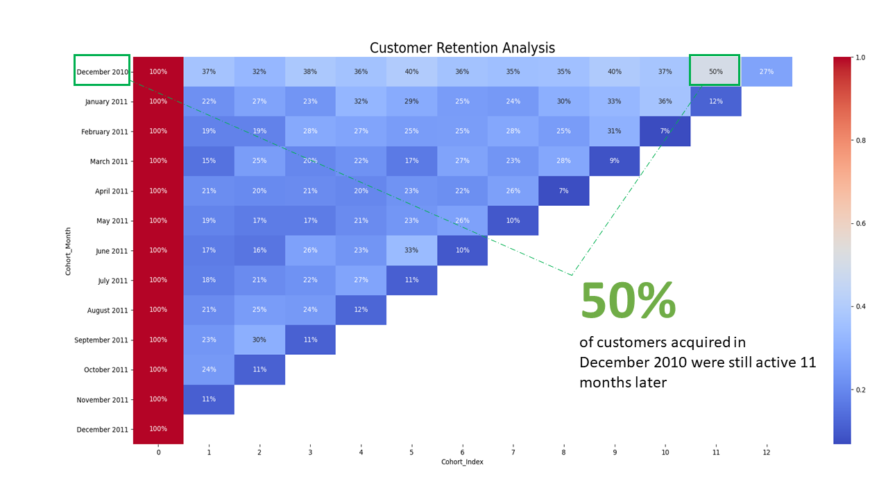

# Portfolio
---
### Customers Segmentation for Marketing | RFM Modeling

In this project, we create a customer segmentation for marketing using a RFM model in python. To perform the segmentation, we calculate and score each customer based on how recent they made their last purchase, how often they make a purchase and how much they have spent in purchase since they first order. Using these scores we are able to identify the most valuable customers and the customers at risk of churning.

[more...](https://github.com/jacobappia/Customers-Segmentation-for-Marketing/blob/main/Customers%20Segmentation%20Analysis.ipynb)

---
### Marketing Campaign Performance Assessment: A/B Testing

In this project we will run an A/B testing analysis by leveraging the Chi-Square test for independence and assess the impact of a new ecommerce web page on the users conversion rate compared to an existing web page. We cleaned the data and defined the required hypothesis for the test. our analysis showed that it will not be a good idea for the company to change their old web page for the new one at the moment.

[more...](projects/AB Testing New Web Page.html)

---
### Customers Cohort Retention Analysis

In this project, we conduct a time-based cohort and retention analysis in python to examine how many customers are staying and how many are leaving in a given cohort over time. We will group customers into cohorts based on the time of acquisition and compute the cohort index which is the number of months since the customer was acquired. We will then compute the retention rates for each cohort over time.

[more...](projects/Cohort Retention Analysis.html)

---
### Detect Spam Messages: NLP-BERT and Naive Bayes Classifier

In order to predict whether a message is spam, first I vectorized text messages into a format that machine learning algorithms can understand using Bag-of-Word and TF-IDF. Then I trained a machine learning model to learn to discriminate between normal and spam messages. Finally, with the trained model, I classified unlabel messages into normal or spam.

---
### Credit Risk Prediction Web App

After my team preprocessed a dataset of 10K credit applications and built machine learning models to predict credit default risk, I built an interactive user interface with Streamlit and hosted the web app on Heroku server.

---
### Predict Breast Cancer with RF, PCA and SVM using Python

In this project I am going to perform comprehensive EDA on the breast cancer dataset, then transform the data using Principal Components Analysis (PCA) and use Support Vector Machine (SVM) model to predict whether a patient has breast cancer.

 

 

---

© 2020 Jacob Appia. Powered by Jekyll and the Minimal Theme.

